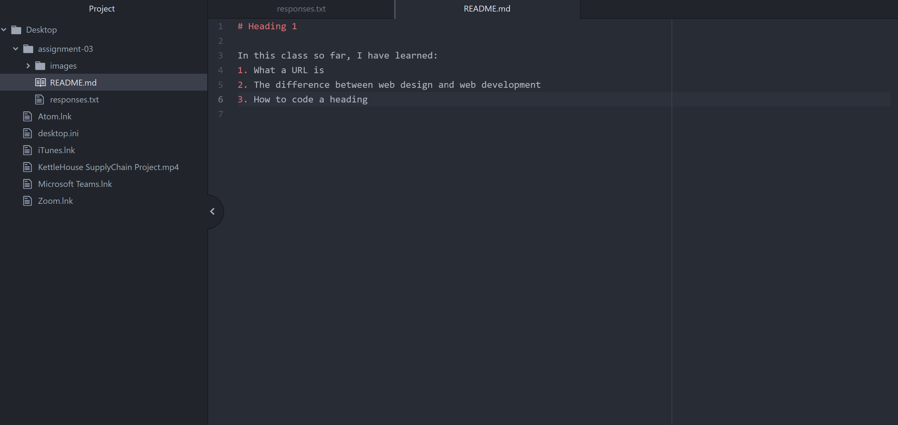

# Heading 1

In this class so far, I have learned:
1. What a URL is
2. The difference between web design and web development
3. How to code a heading

[Netflix](https://netflix.com/)

[Responses](./responses.txt)

