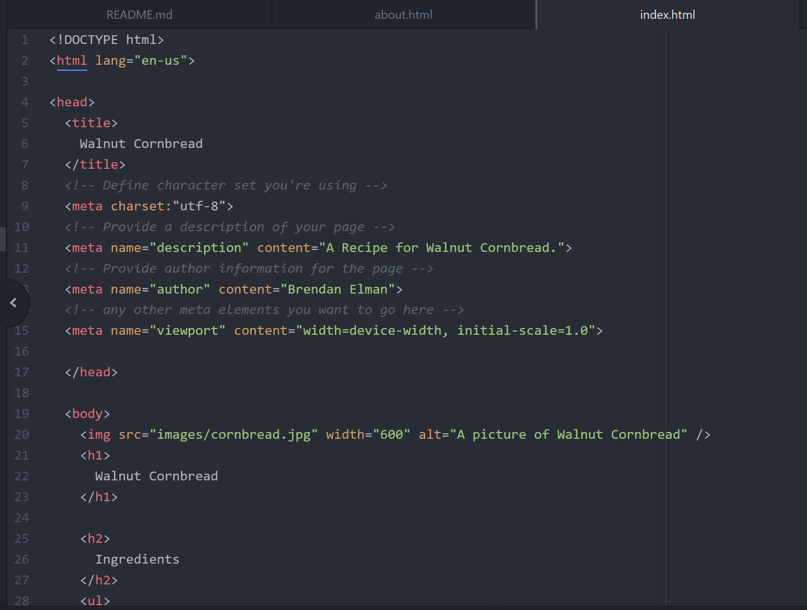
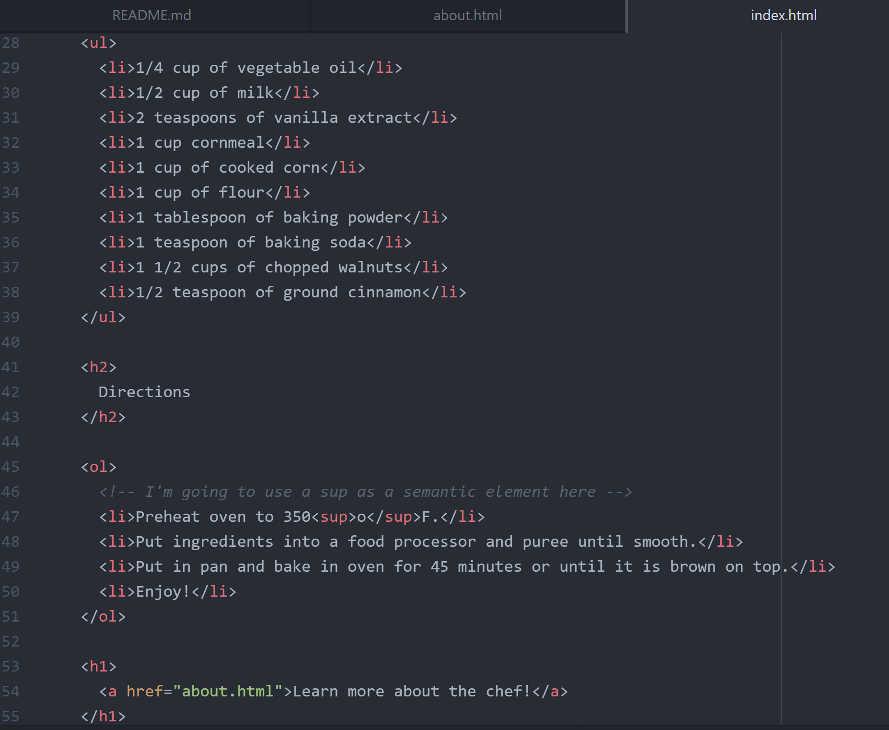
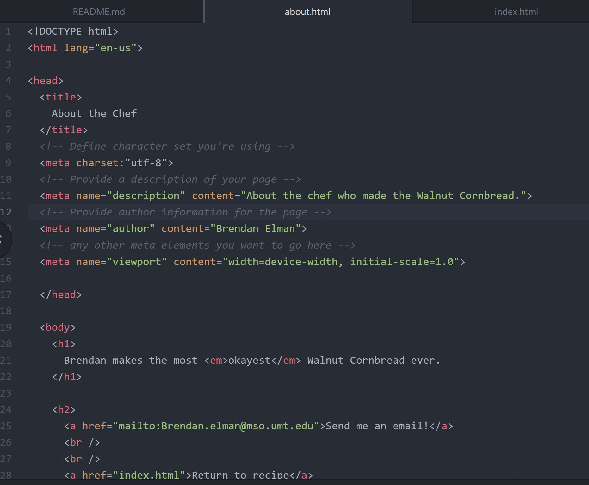

Semantic markups define the purpose of an element and are used in situations where you may need to bold or strong an element. Structure markups explain the relation of content to other content within the document and would be used to structure paragraphs or headings.

