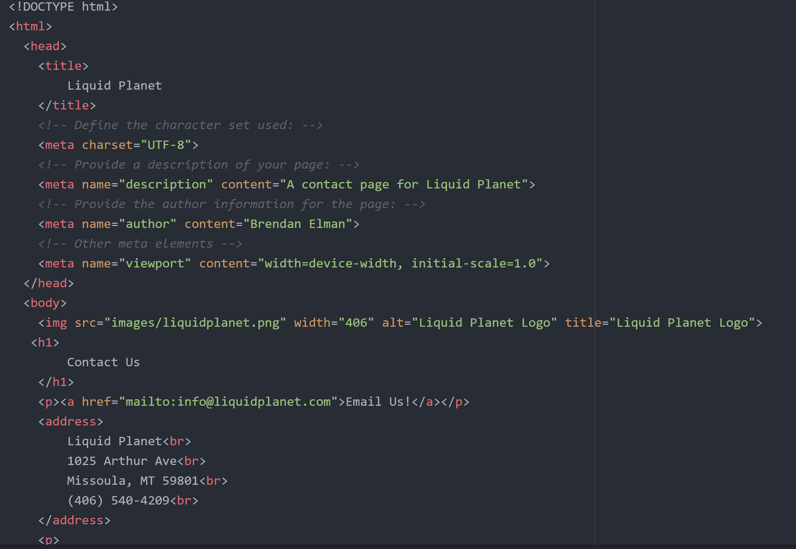
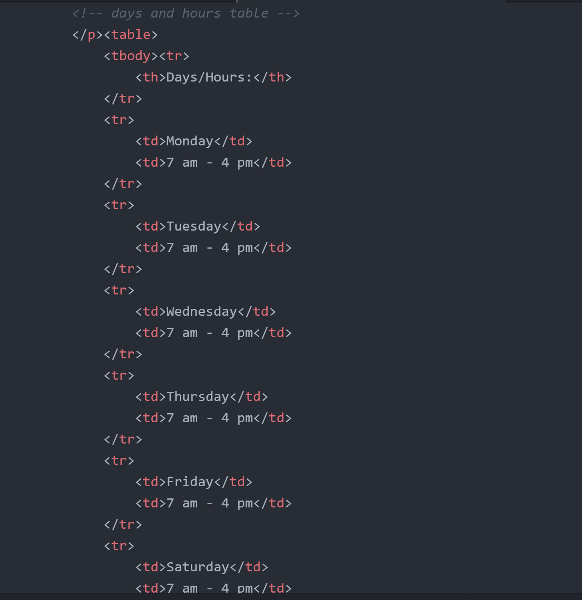
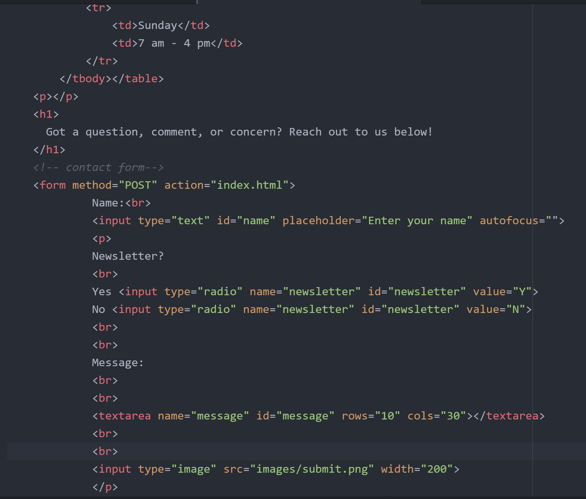

When browsing the web, the most common forms that I come across are contact us forms. They are straightforward forms that require phone number, email, and name and allow for you to write a message to a business and have them reach out to you in response to your message. Another form that I see sometimes online are waiting list forms to be alerted for certain product releases or restocks.

