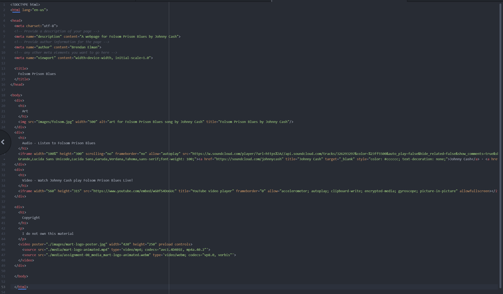

1. Affordances are the prompts, texts, placements, and other types of clues in web design that show the user how to interact with an object or what its content is.
2. The advantage of using Youtube or Vimeo to host your videos is convenience. You can select from thousands of existing videos that suit your needs or easily upload one that you want to use for free. The disadvantage would be that you lose some control by using those sites and the video could be deleted off their site without you knowing.
3. Obstacles I faced this week with this assignment was mainly time management related. The balancing act between work and school can get difficult sometimes.

