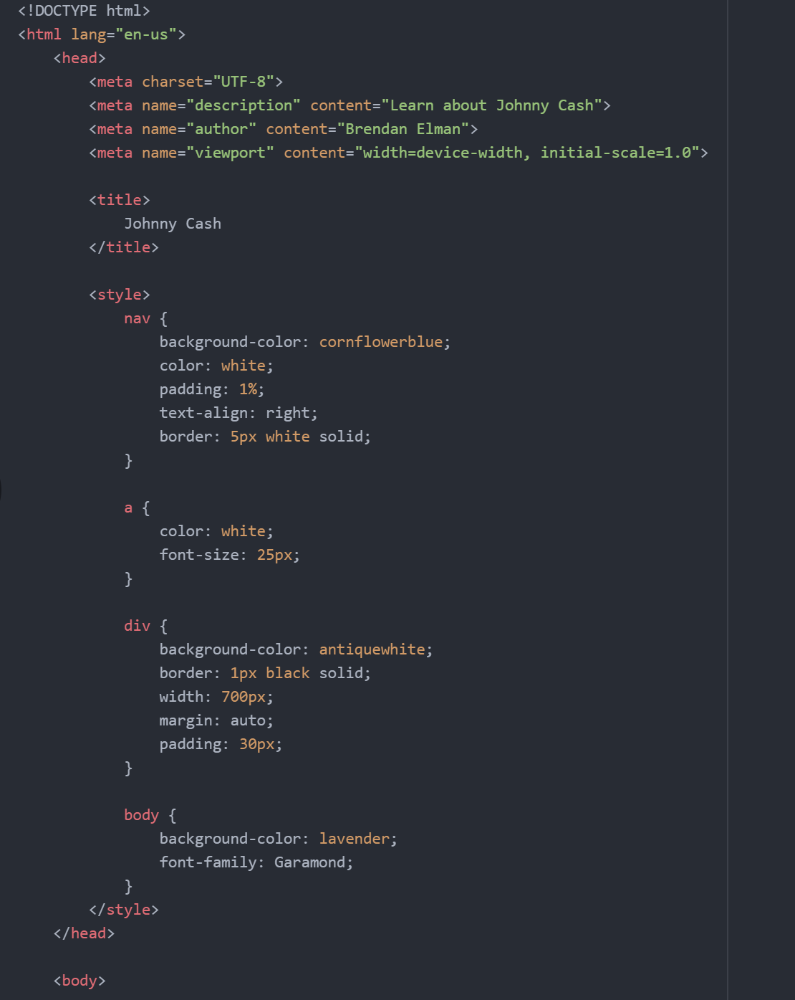

Learning html has been a fun experience for me. It is challenging to get the hang of at first, but once an assignment is complete, it is very cool to see all of your work turn into a real webpage.
I am excited to expand upon the skills that I learned in this section and learn more about styling. I am still unsure about how to find the different colors to use for the webpages so I think this next section will clear up any of my confusion about the styling.

