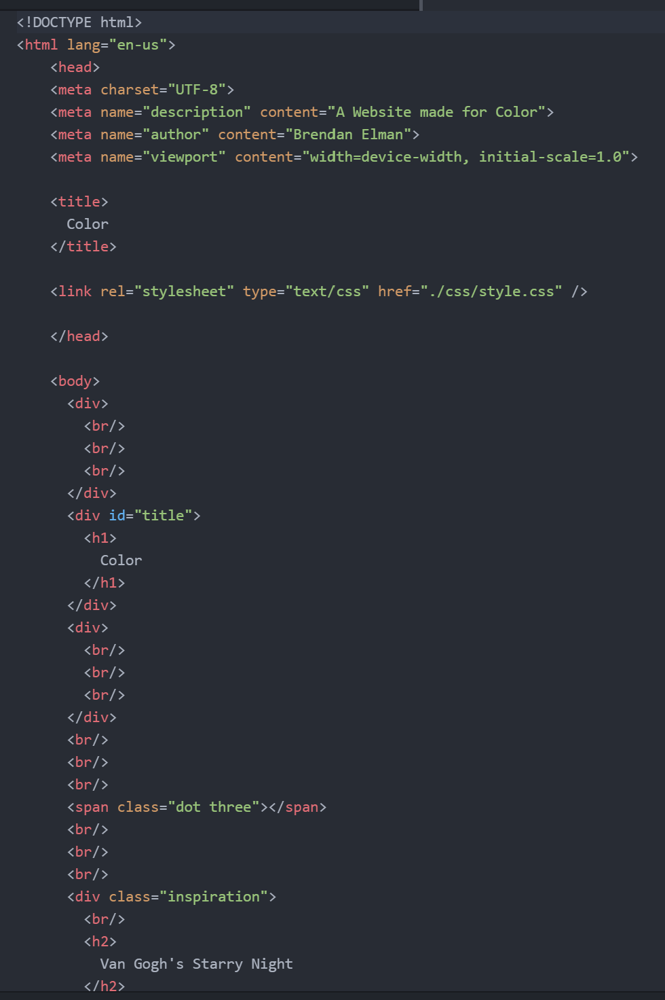

1. Universal selectors style every element on the page so you would want to use this selector when you are trying to change the whole page. The element selector is used to select all elements of a certain type and would be used when trying to style a certain header or segment of the page. Class selectors change the style of elements that serve the same function and would be best used when wanting to make a pattern with your style or changing specific class styles. Finally, the ID selector allows developers to define style rules for a specific element by calling its unique ID and this would be used when changing the style of one specific element.

2. I chose my colors based on the most prominent colors in Van Gogh's starry night painting because I've always enjoyed that painting and artist.

