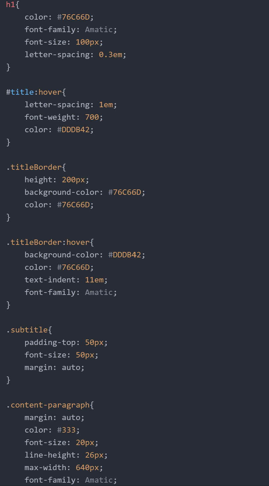

1. Typography is the style and appearance of printed matter or the way in which you arrange the information you are presenting, whether that be with font, text size, color, etc.
2. Fallback fonts or font stacks are important because some users don't have access to all of the fonts or some fonts may load too slowly and there needs to be a "backup" font that easily transitions into the place of the original font.
3. System fonts are those already installed on your local device and system, Web fonts are custom fonts hosted on a server, and web-safe fonts are fonts that developers can count on being available by the system.

