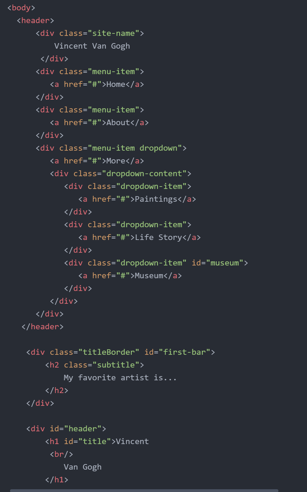

1. A border is used to surround or encase content. Padding is the amount of space between the inner content of the element and the element itself. Finally, margin is the space between the element and other elements, or the edge of the parent element. To put this all together, your content is surrounded by padding, which is then surrounded by a border, which in turn is surrounded by a margin. All of this is encased in the parent element.

